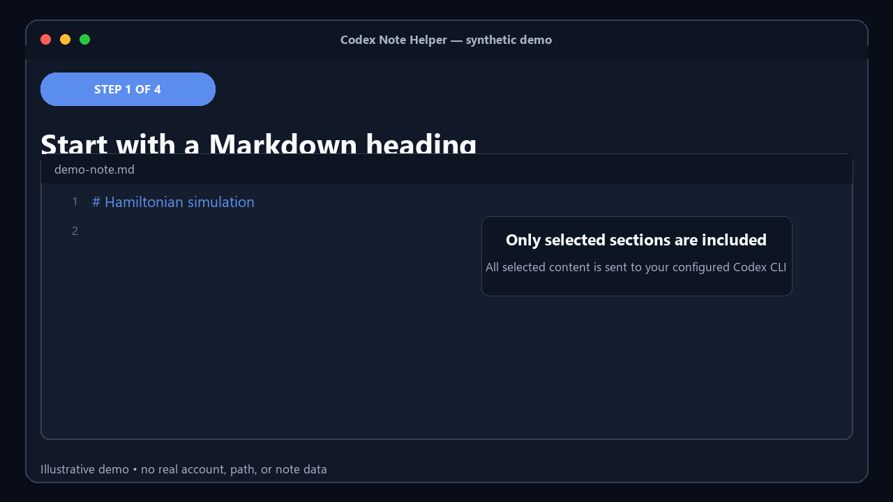

# Codex Note Helper

[English](README.md)


Markdown の対象見出しから Codex CLI で調査・一般・就活ノートを生成します。
構造を検証した VS Code の差分を確認し、Apply または Discard を選ぶまで生成内容は
適用されません。



_隔離したVS Codeプロファイルで、固定した合成ノートと更新案を使って収録しています。
収録時にCodexは呼び出さず、アカウント情報、ホスト固有のパス、プロバイダー出力を
含みません。_

[VS Code Marketplaceからインストール](https://marketplace.visualstudio.com/items?itemName=trinitrotorol.codex-note-helper)

```sh
code --install-extension trinitrotorol.codex-note-helper
```

拡張機能自体は無料です。Codexの実行は、プランに含まれる利用枠や購入済みの利用枠を
消費するほか、CLIに設定したプロバイダーによっては従量課金が発生する場合があります。
Codexの認証とプロバイダーの規約は別途適用されます。この拡張機能が独自のAPIキーを
要求・保存することはありません。

## 60秒クイックスタート

1. ローカルまたはリモートのVS Code拡張ホストに互換性のあるCodex CLIを導入し、
   サインインします。公式OpenAI VS Code拡張機能の同梱CLIも明示的に選択できます。
2. Codex Note Helperをインストールし、
   **Codex ノート: Codex CLI の取得元を選択**を実行します。
3. **Codex ノート: 診断を実行**を実行します。診断は実行ファイルと必須CLIフラグを
   確認しますが、ノート本文の送信や生成リクエストは行いません。
4. 信頼済みウィンドウで保存済みMarkdownファイルを開き、見出しを追加します。

   ```markdown
   # ハミルトニアンシミュレーション
   ```

5. **Codex ノート: 対象見出しの更新案を生成して確認**を実行します。
6. 差分を確認し、明示的に適用または破棄します。通知が隠れた場合は、ステータスバー
   または保留レビュー用コマンドを使えます。再表示でCodexを再実行することはありません。

VS Codeや他の拡張機能との衝突を避けるため、既定ショートカットはありません。
必要に応じてキーボードショートカット画面から割り当ててください。

## できること

設定したMarkdown見出しレベルの対象セクションを検出し、Codex CLIへ構造化された
更新案を要求します。生成モードは次の3種類です。

- `research`: 簡潔な研究ノート。検証できる場合のみ参考文献を含めます。
- `general`: 参考文献を必須としない簡潔な説明ノート。
- `jobHunting`: 企業、職務適合性、選考、面接準備用ノート。

空のセクションだけ、空または情報源の箇条書きだけ、すべての一致セクション、という
対象ポリシーを選べます。人が書いた既存内容は保持し、生成ブロックは拡張機能専用の
マーカーで分離します。

## 安全性の要点

- 設定済みCodex CLIへ、対象見出し、選択されたすべてのセクションの現在のMarkdown、
  生成設定を送ります。ワークスペースパス、ファイルパス、未選択部分の本文は
  プロンプトへ入れません。対象ポリシーですべての一致セクションを選ぶと、選択内容の
  合計がノートの大部分を含む場合があります。
- Codexは拡張機能専用領域から、読み取り専用・一時セッションで実行されます。
  リポジトリルールを無視し、承認モードを`never`に固定し、shell、apps、hooks、
  multi-agentを無効化します。
- Web検索は既定で無効です。有効にした場合やCodexユーザー設定を有効にした場合は、
  毎回確認します。
- すべてのイベントと構造化更新を上限付きで検証します。プロセスの正常終了だけでは
  編集を許可しません。
- 適用直前に、同じ文書インスタンス・版・テキストか再確認します。編集、閉じる、
  再オープンにより古くなった更新案は無効化します。
- 差分確認と明示的な決定は必須です。通知を閉じても破棄にはならず、保留状態を維持します。

構造検証は内容の正確性を保証しません。生成内容と情報源を確認してください。機密ノートを
使う前に、Codexプロバイダーと保存ポリシーを確認してください。完全な脅威モデルと制御は
[SECURITY.md](SECURITY.md)にあります。

Codex Note Helper独自の解析・利用状況テレメトリ送信はありません。VS Code、Codex CLI、
設定済みプロバイダーにはそれぞれのポリシーと設定があります。

## 必要条件

- VS Code 1.85.0以降。
- 信頼済みVS Codeウィンドウと、保存済みのローカルまたはリモートMarkdownファイル。
- `PATH`、明示設定した絶対パス、または明示的に許可した公式OpenAI拡張機能同梱版の
  互換Codex CLI。
- 拡張ホスト上のCodex認証。Remote SSH、WSL、Dev Containers、Codespacesでは、
  リモート側でCLIを導入・認証します。

`file`と`vscode-remote`文書のみ対応します。Untitled文書（まだファイルとして保存されて
いない文書）、Git/diff文書、仮想ワークスペース、信頼されていないワークスペースは
拒否します。ファイルとして保存済みであれば、未保存の編集中変更があっても対象にできます。

## 主なコマンド

| コマンド | 用途 |
| --- | --- |
| **対象見出しの更新案を生成して確認** | 生成・検証して必須差分を開きます。 |
| **保留中の変更を確認** | Codexを再実行せず既存差分を再表示します。 |
| **保留中の変更を適用** | 文書状態を再確認して検証済み更新案を適用します。 |
| **保留中の変更を破棄** | 更新案を明示的に破棄します。 |
| **実行中の処理をキャンセル** | 生成または保留レビューをキャンセルします。 |
| **Codex CLI の取得元を選択** | `PATH`、利用可能な公式同梱版、絶対パス用設定を選びます。 |
| **診断を実行** | 保存領域、信頼状態、実行許可、CLI版、必須フラグを確認します。 |
| **対象見出しを一覧表示** | 現在の見出しレベルとポリシーの対象を確認します。 |

生成モード、対象ポリシー、診断ログ削除にもコマンドパレットからアクセスできます。

## 主な設定

| 設定 | 既定 | 用途 |
| --- | --- | --- |
| `codexNoteHelper.mode` | `research` | 生成プロファイル。 |
| `codexNoteHelper.fillPolicy` | `emptyOnly` | 対象セクション。 |
| `codexNoteHelper.outputLanguage` | 日本語UIでは`Japanese` | 出力言語。 |
| `codexNoteHelper.headingLevel` | `1` | 対象見出しレベル。 |
| `codexNoteHelper.codexCommand` | `codex` | マシン単位の実行名または絶対パス。 |
| `codexNoteHelper.allowBundledCodexFromOpenAIExtension` | `false` | 公式同梱版への明示的なフォールバック。 |
| `codexNoteHelper.enableWebSearch` | `false` | 情報源検証用の追加ネットワーク検索。 |
| `codexNoteHelper.ignoreCodexUserConfiguration` | `true` | 認証を維持しつつユーザー設定を無視。 |
| `codexNoteHelper.applySaveBehavior` | `leaveUnsaved` | 適用後は未保存のままにするか、適用直前まで保存済みだった場合だけ保存します。VS Codeの自動保存は引き続き有効です。 |

その他の上限・確認設定はVS Codeの拡張機能設定画面に説明付きで表示されます。

## トラブルシューティング

### Codex CLIが見つからない

**Codex CLI の取得元を選択**を実行してください。`PATH`を推奨します。公式OpenAI
拡張機能に同梱版がある場合、エラーの操作から専用設定を開けますが、自動では有効化しません。
どの取得元も実体パス検査、SHA-256フィンガープリント同意、互換性検査を通ります。

### ApplyまたはDiscardが消えた

更新案は保留されています。ステータスバー、**保留中の変更を確認**、
**保留中の変更を適用**、**保留中の変更を破棄**を使用してください。元ノートを編集・閉じる・
再オープンすると、古い更新案は適用せず無効化します。

### 診断に失敗した

診断出力には、安全な原因コードと解決案だけを表示します。生のパス、ノート本文、プロンプト、
モデル出力、stdout、stderr、stack traceは記録しません。拡張機能専用ログはエラー操作から開き、
**診断ログを削除**で削除できます。

## ドキュメントとサポート

- [English README](README.md)
- [セキュリティとプライバシー](SECURITY.md)
- [変更履歴](CHANGELOG.md)
- [開発・検証・リリース](https://github.com/trinitrotorol/codex-note-helper/blob/main/CONTRIBUTING.md)
- [Issue tracker](https://github.com/trinitrotorol/codex-note-helper/issues)

バグ報告にノート本文、プロンプト、フルパス、生プロセス出力、認証情報、トークンを添付しないで
ください。GitHub Security Advisoriesの非公開報告が利用できる場合はそれを使い、利用できない
場合は機密情報を含めず、影響だけを記した最小限のIssueを作成してください。

## ライセンス

[MIT](LICENSE)
